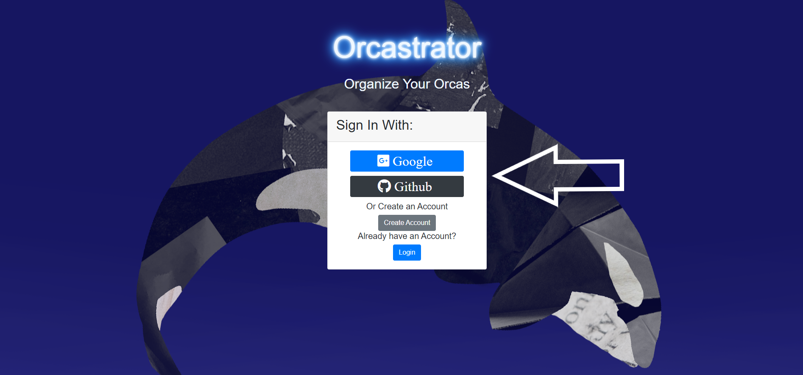
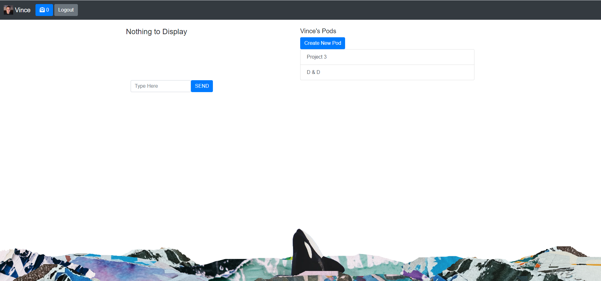
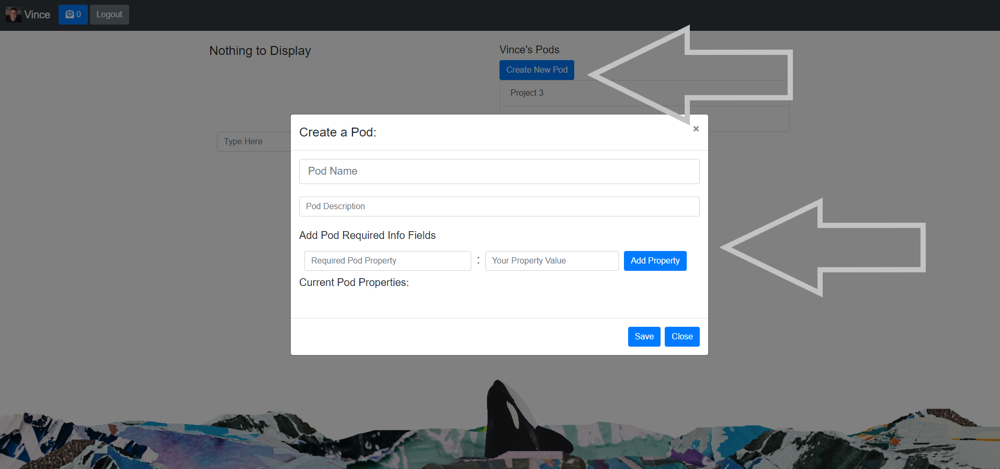
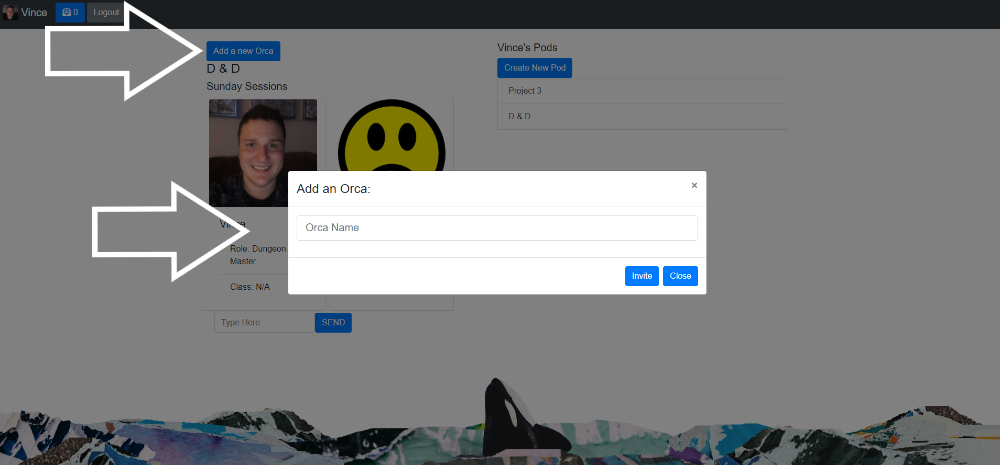
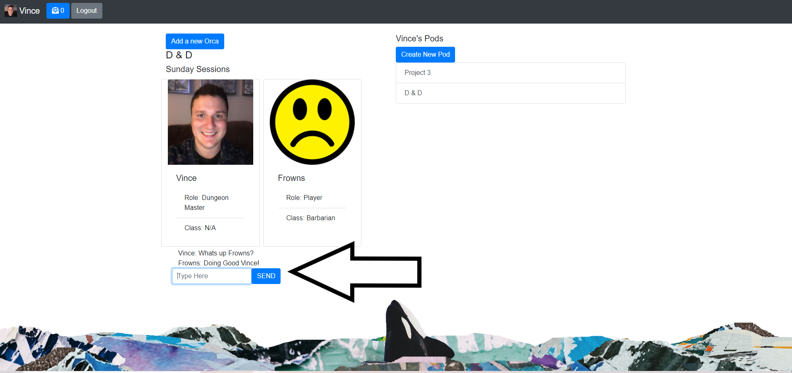

# Orcastrator

## Overview:
This app allows a user to create new pods(groups) and send invites to fellow orcas(users) to join your created pod! While in a pod you are in an active chat room with anyone else in the same pod!  This was primarily accomplished using React, Express, node.js, and Socket.io.  

### Table of Contents:
1. [How it works](#How-it-works)
2. [Example](#Example)
3. [Installation](#Installation)
4. [Contributing](#Contributing)
5. [Questions](#Questions)
6. [License](#License)

### How it works!
Once you enter the app you will need to either sign in with github or google or create a local account and sign in with those credentials.  Then Create a pod by clicking the create a pod button and fill out the info.  Lastly add orcas to your pod by first selecting the pod then clicking the add an orca button.  Enter the username of the orca you would like to invite and hit invite.  On the recieving end of an invite you will need to accept the invite request before being placed in the pod.  Once you have other fellow orcas in your pod feel free to enter the pod Chat room and send messages to each other.

Sign In      Enter Dashboard      Create Pod      Add Orcas      Chat Among Orcas      

### Example
Here is a link to the Orcastrator:  [https://orcastrator.herokuapp.com/](https://orcastrator.herokuapp.com/)

### Installation
Clone the repo npm i in the root folder as well as the client folder

### Contributing
If you would like to contribute to the development of this app the guidelines for doing so can be found here: [Contribution Covenant](https://www.contributor-covenant.org/version/2/0/code_of_conduct/code_of_conduct.txt)

### Questions?
Visit my Github profile here: [vfavorito](https://github.com/vfavorito) 
If you have any questions you can reach out to me at vince.favorito@gmail.com

### License
This App is covered under the MIT License
 
© 2021 Vincent Favorito  
© 2021 Ricky Cohen  
© 2021 Caleb Walker 
© 2021 Amy Paschke 
© 2021 Daron Schmit  
